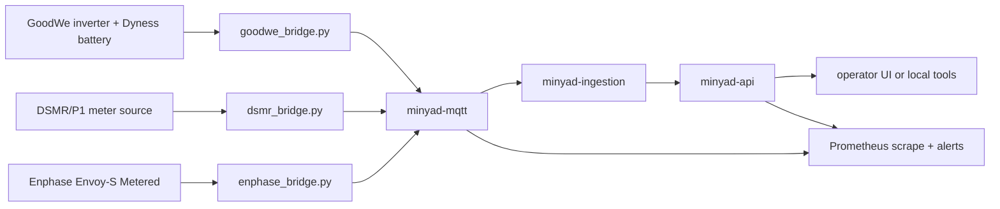

[](https://github.com/dschutterop/minyad-core/actions/workflows/release.yml)

# Minyad Core

Minyad Core is open-source home energy plumbing for post-net-metering prosumers who want reliable battery, PV, grid-meter, MQTT, and Prometheus integration before adding their own control logic.

## Why This Exists

Dutch net metering (`saldering`) ends at the close of 2026. That changes the economics for households with PV and batteries: surplus power, import windows, and local telemetry start to matter every day. Minyad Core publishes the reusable foundation for that world: hardware bridges, stable MQTT topics, monitoring, and deployment scaffolding that a competent DIY or homelab operator can adapt.

## Included and Not Included

Included:

- GoodWe host bridge for inverter/battery telemetry and Modbus limit actuation.
- DSMR/P1 bridge for grid import/export telemetry.
- Enphase Envoy-S bridge for PV production telemetry.
- Prometheus scrape examples, recording rules, and alert rules.
- Docker Compose scaffolding for the public ingestion, API, MQTT, bridge, and monitoring pieces.
- Setup docs, sanitized configuration examples, and an RS485/Modbus migration guide.

Not included:

- Trading, day-ahead pricing, and ENTSO-E integrations.
- Optimization strategy, planner, tracker, guard, and scheduler internals.
- Operator-agent, mailbox, prompt, and commercial decision-support logic.

In plain terms: this repository provides the batteries-included plumbing, not the private strategy brain.

## Hardware Supported

- GoodWe ES-family hybrid inverter installations.
- Dyness DL-series batteries as seen through the inverter.
- DSMR/P1 smart meters via an MQTT-producing DSMR reader.
- Enphase Envoy-S Metered installations.
- RS485 to Ethernet Modbus gateways, including Waveshare-style TCP-to-RTU bridges.

The most reusable field notes are in the [RS485 and Modbus guide](docs/rs485-modbus-guide.md). Start there if you are moving away from inverter WiFi dongles or trying to make Modbus reliable enough for automation.

## Quick Start

```bash
git clone https://github.com/YOUR-ORG/minyad-core.git
cd minyad-core
cp .env.example .env
docker compose up -d
```

Edit `.env` before connecting real hardware. Keep private addresses, tokens, OAuth secrets, and certificates out of git.

Host-side hardware bridges can run as systemd services:

```bash
python3.12 -m venv host-services/venv
host-services/venv/bin/python -m pip install --upgrade pip
host-services/venv/bin/python -m pip install -r host-services/requirements.txt
sudo cp host-services/*.service /etc/systemd/system/
sudo systemctl daemon-reload
```

Enable only the bridges you actually use, and dry-run any Modbus write path before allowing it to touch hardware.

## Architecture



## Monitoring

Prometheus examples live under `prometheus/`, with additional notes in [docs/monitoring.md](docs/monitoring.md). Bind metrics to a trusted interface and avoid exposing bridge metrics directly to the internet.

## Contributing

See [CONTRIBUTING.md](CONTRIBUTING.md) for hardware-reporting details and PR expectations. The short version: keep bridge behavior generic, include useful logs with secrets removed, and do not submit strategy or trading features to this public core.

## License

Minyad Core is licensed under the GNU Affero General Public License v3.0. If you run a modified Minyad service for users over a network, the AGPL requires you to make the corresponding source available to those users.

## Project Lineage

Minyad is part of Daniel's broader The Ice Cream Engineer project: practical engineering notes from the edge of home energy, software, and stubborn real-world hardware.
